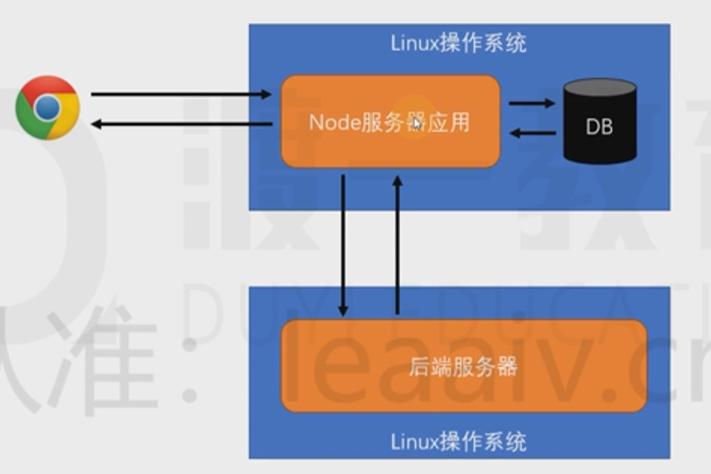

## 一、Node特点
1. Node优点就是吞吐量，可以处理大量的用户请求，因为是异步模式，没有进程切换的开销，不适合处理大量运算
- 适合转发请求，直连数据库适合存储请求日志、用户偏好、广告信息、静态资源托管、访问较多的页面数据缓存
2. JAVA是多线程，一个请求一个线程，但是适合大量运算

## 二、全局对象
1. setTimeout、setInterVal、setImmediate、console、__dirname、__filename、Buffer、process 
2. process常用cwd()、exit()、argv、platform、kill(pid)、env
3. cwd()获取目录

## 三、模块化
1. 模块查找
- 绝对路径
- 相对路径./，相对当前模块转换为绝对路径
- 另一种相对路径，检查内置模块如fs、path，再检查node_modules，最后转为绝对路径
- 后缀名自动补全，顺序为js、json、node、mjs
- 文件名自动找目录下index.js
- package.json会找main字段 默认也是index.js
- require是个函数，内部通过call执行，默认this指向module.exports与exports指向同一个对象，module.exports改变时，this转换改变指向，但依然指向exports
- 模块是commmonjs或esmodule之一，默认commmonjs，文件后缀改成.mjs或package.json中type改为module

## 四、内置模块
1. OS 读取操作系统的信息 
- os.cpus()获取所有cpu内核 
- os.tmpdir()获取node临时文件地址
2. path
- path.sep 获取当前系统文件分隔符 /或\
- path.dirname获取文件路径
- path.extname获取文件后缀名
- path.join拼接路径
- path.resolve(__dirname,'')将路径解析为绝对路径,__dirname表示当前模块所在的文件夹
3. url 获取url并解析
4. util
- util.callbackify()将promise转成callback的形式，高阶函数
- util.promisify()将callback转为promise
- util.isDeepStrictEqual()比对两个对象是否深度相等

## 五、fs模块文件IO
- fs.readFile读取文件 默认返回buffer,readFileSync导致JS运行阻塞，影响性能  
- fs.writeFile写入文件
- fs.stat获取文件或目录信息
- fs.readdir获取文件子目录
- fs.mkdir创建目录
- fs.exists判断文件或目录是否存在

